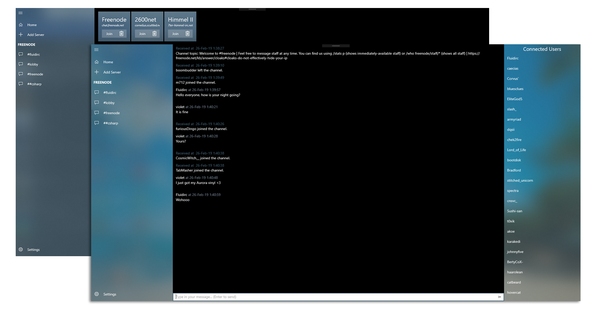

<h3 align="center">
    
    
<b>Fluid IRC is an UWP based irc client made with the sole purpose of offering a more modernized feel of the irc world.</b>

</h3>

    <a href="#description">Description</a> •
    <a href="#features">Features</a> •
    <a href="#how-to-use">How To Use</a> •
    <a href="#license">License</a>

     
    
     
    
    

## Description

Fluid IRC right now is here to accompany you with a minimalistic responsive interface.

Its current state is still very raw offering very little features of the IRC world, but many of them are on the road map and you can check them in the `Issues` tab.

## Features

* Responsive interface
* Scalable UI
* Multi channel support
* Persistent server & user profile storage
* User profile configurable per server
* <i>And of course the features that come with UWP (dark/light theme, acrylic design, fancy animations, etc.)</i>

## How to use

Add a server, join and you're ready to go. Keep in mind in the current state the interface isn't there entirely to replace commands but rather give you a visual perspective of what's happening.

You'd be better off if you start knowing the basics of [irc commands](https://en.wikipedia.org/wiki/List_of_Internet_Relay_Chat_commands).

## License

MIT